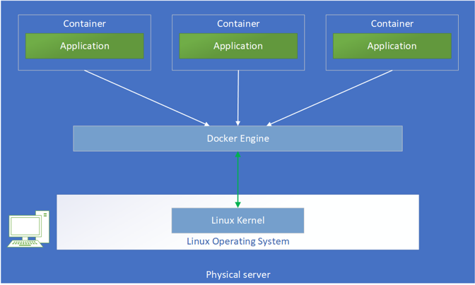
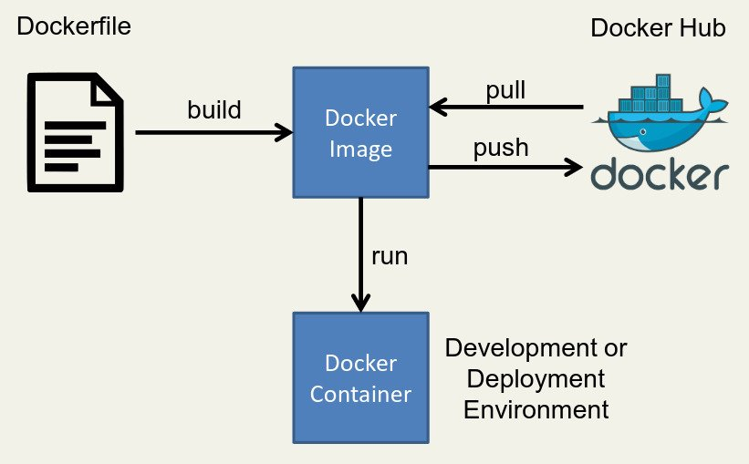
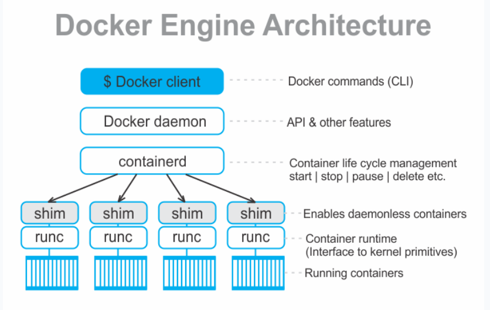
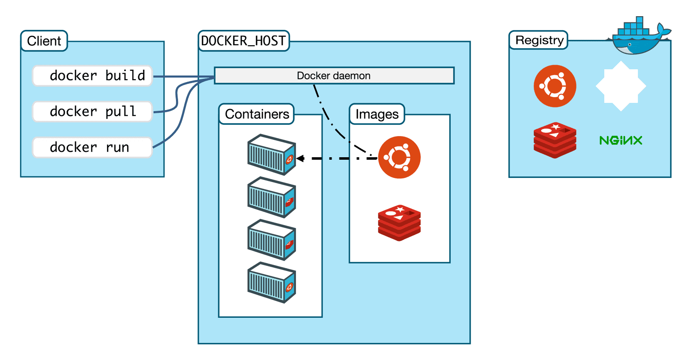

## Docker Architecture

Notes about docker , docker architecture,  how docker works and other docker concepts.

# Table Of Contents

- **[What is Docker](#what-is-docker-whale)**
- **[What are Docker Containers](#what-are-docker-containers-ship)**
- **[What are Docker Images](#what-are-docker-images-framed_picture)**
	- **[Docker image](#docker-image)**
	- **[Docker image repositories](#docker-image-repositories)**
- **[Docker Core Architecture](#docker-core-architecture-european_castle)**
	- **[Docker core architecture](#docker-core-architecture)**
		- **[Docker Engine](#docker-engine)**
		- **[Docker Containerd](#docker-containerd-containerd)**
		- **[Docker Runc](#docker-runc)**
	- **[How Does Docker Work?](#how-does-docker-work)**
		- **[Docker host](#docker-host)**
		- **[Docker daemon](#docker-daemon)**
		- **[Docker client](#docker-client)**
		- **[Dockerfile](#dockerfile)**
		- **[Docker volumes](#docker-volumes)**
		- **[Docker networks](#docker-networks)**

## What is Docker :whale:

Docker is a software framework for building, running, and managing containers on servers and the cloud. The term "docker" may refer to either the tools (the commands and a daemon) or to the `Dockerfile` file format.

It used to be that when you wanted to run a web application, you bought a server, installed _Linux_, set up a LEMP stack, and ran the app. If your app got popular, you practiced good _load balancing_ by setting up a second server to ensure the application wouldn't crash from too much traffic.

Times have changed, though, and instead of focusing on single servers, the Internet is built upon arrays of inter-dependent and redundant servers in a system commonly called "the cloud". Thanks to innovations like _Linux kernel namespaces and cgroups_, the concept of a server could be removed from the constraints of hardware and instead became, essentially, a piece of software. These software-based servers are called [containers](#what-are-docker-containers),  and they're a hybrid mix of the Linux OS they're running on plus a hyper-localized runtime environment (the contents of the container).

## What are Docker Containers :ship:

Container technology can be thought of as three different categories:

- **_Builder_**:  a tool or series of tools used to build a container, such as a Dockerfile for Docker.
- **_Engine_**: an application used to run a container. For Docker, this refers to the _docker_ command and the `dockerd` daemon.
- **_Orchestration_**: technology used to manage many containers, including Kubernetes and OKD.

_Containers_ often deliver both an application and configuration, meaning that you don't have to spend as much time getting an application in a container to run compared to when an application is installed from a traditional source. [Dockerhub](http://hub.docker.com/) are repositories offering [images](#What-are-docker-images) for use by container engines.

The greatest appeal of containers, though, is their ability to "die" gracefully and re-spawn when load balancing demands it. Whether a container's demise is caused by a crash or because it's simply no longer needed because server traffic is low, containers are "cheap" to start, and they're designed to seamlessly appear and disappear. Because containers are meant to be ephemeral and to spawn new instances as often as required, it's expected that monitoring and managing them is not done by a human in real time, but is instead automated.

Docker containers have their own file system, dependency structure, processes, and network capabilities. The application has everything it requires inside the container and can run anywhere. Docker container technology uses the underlying host operating system kernel resources directly.

## What are Docker Images :framed_picture:

##### Docker image

A Docker image is a file used to execute code in a Docker container. Docker images act as a set of instructions to build a Docker [container](#what-are-docker-containers), like a template. Docker images also act as the starting point when using Docker. An image is comparable to a _snapshot in virtual machine (VM) environments_.

Docker is used to create, run and deploy applications in containers. A Docker image contains application code, libraries, tools, dependencies and other files needed to make an application run. When a user runs an image, it can become _one or many instances of a container_.

Docker images have _multiple layers_, each one originates from the previous layer but is different from it. The layers speed up Docker builds] while increasing re-usability and decreasing disk use. Image layers are also **read-only** files. Once a container is created, a **writable layer** is added on top of the unchangeable images, allowing a user to make changes.

A Docker image has everything needed to run a containerized application, including code, config files, environment variables, libraries and run-times. When the image is deployed to a Docker environment, it can be executed as a Docker container. The `docker run command` creates a container from a specific image.

##### Docker image repositories

Docker images are a reusable asset -- deployable on any host. Developers can take the static image layers from one project and use them in another. This saves the user time, because they do not have to recreate an image from scratch.

Docker images get stored in private or public repositories, such as those in the [Docker Hub](http://hub.docker.com) cloud registry service, from which users can deploy containers and test and share images.

_Official images_ are ones Docker produces, while _community images_ are images Docker users create.

Users can also create new images from existing ones and use the `docker push` command to upload custom images to the Docker Hub.

**Note** :Docker images can be created through [Dockerfiles](dockerfile.md)

## Docker Core Architecture :european_castle:

##### Docker core architecture

When Docker was initially launched, it had a _monolithic architecture_. Now it is separated into the following three different components:

1. Docker Engine (`dockerd`)
2. docker-containerd (`containerd`)
3. docker-runc (`runc`)

###### Docker Engine

Docker engine comprises the docker daemon, an API interface, and Docker CLI. Docker daemon (`dockerd`) runs continuously as `dockerd` systemd service. It is responsible for building the docker images.

To manage images and run containers, `dockerd` calls the `docker-containerd` APIs.

###### docker-containerd (`containerd`)

`containerd` is another system daemon service than is responsible for downloading the docker images and running them as a container. It exposes its API to receive instructions from the `dockerd` service

###### docker-runc

`runc` is the container runtime responsible for creating the namespaces and cgroups required for a container. It then runs the container commands inside those namespaces. runc runtime is implemented as per the _OCI specification_.

**Note** : `containerd` is responsible for _managing_ the container and `runc` is responsible for _running_ the containers (create namespaces, cgroups and run commands inside the container) with the inputs from `containerd`
##### How Does Docker Work?

We will understand Docker Workflow  by having a clear look at its  **high-level docker architecture**.

Docker works on a _client-server architecture_. It includes the _docker client_, _docker host_, and _docker registry_. The docker client is used for triggering docker commands (CLI), the docker host is used to running the docker daemon (`dockerd`), and the docker registry to store docker images.

###### Docker host

Docker Host is used to provide an environment to execute and run applications. It contains the docker daemon, images, containers, networks, and storage.
###### Docker daemon

The docker daemon (`dockerd`) monitors API request and control docker objects like containers, images, volumes, and networks. For managing docker services, a daemon can also communicate with other daemons.

By default, the docker daemon listens to the `docker.sock` UNIX socket. If you have any use case to access the docker API remotely, you need to expose it over a host port.
###### Docker client

The docker client is the major way that provides communication between many dockers users to Docker. The client sends commands (docker API) used by the users such as `docker run` to the _dockerd_. To manage docker services, docker clients can be communicated with more than one daemon.

Docker Client uses Command Line Interface (CLI) to run many commands , mainly : 

- `docker build` : building images from [Dockerfiles](#dockerfile)
- `docker pull` :  Pulling images from the Docker image repository (The docker registry)
- `docker run` : Starting a container

###### Dockerfile

Docker has a concept of `Dockerfile` that is used for building the image. A Dockerfile a text file that contains one command (instructions) per line.

###### Docker volumes

All the changes inside the container are lost when the container stops. If we want to keep data between runs or to share data between different containers, Docker volumes and bind mounts come into play.

Volumes are managed by Docker to allow data to be written outside the container instance, which allows it to persist outside of the actual container instance’s lifecycle.

This option is what makes containers capable of handling persistent data, which allows databases and other data-driven applications to run inside Docker without worrying about data loss. Storage drivers can take advantage of cloud, network-attached, and other high-performance storage subsystems while providing the best performance characteristics to support an application’s needs.

###### Docker networks

Docker networking is primarily used to establish communication between Docker containers and the outside world via the host machine where the Docker daemon is running.

Docker uses your host’s network stack to implement its networking system. It works by manipulating **_iptables_** rules to route traffic to your containers. This also provides isolation between Docker networks and your host.

Docker supports different types of networks via network drivers, each fit for certain use cases.