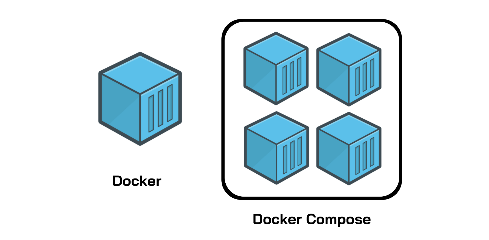

## Docker-Compose Notes

Notes about _docker-compose_ file, a complete docker-compose file reference, the main commands  and some best practices.


## What is a docker-compose file?

###### Introduction

**Docker Compose** is a Docker tool used to define and run multi-container applications. With Compose, you use a `YAML` file to configure your application’s services and create all the app’s services from that configuration.In other words,  `docker-compose` is an **automated multi-container workflow.**

the most popular features of Docker Compose are:

- Multiple isolated environments on a single host
- Preserve volume data when containers are created
- Only recreate containers that have changed
- Variables and moving a composition between environments
- Orchestrate multiple containers that work together

###### Dockerfile vs Docker Compose

Both Dockerfile and Docker Compose are tools in the Docker image ecosystem. **Dockerfile** is a text file that contains an image, and the commands a developer can call to assemble the image. The commands are typically simple processes like installing dependencies, copying files, and configuring settings.

**Docker Compose** is a tool for defining and running multi-container Docker applications. Information describing the services and networks for an application are contained within a `YAML` file, called `docker-compose.yml`.

One of the base functions of Docker Compose is to `build` images from _Dockerfiles_. However, Docker Compose is capable of **orchestrating** the containerization and deployment of multiple software packages. You can select which images are used for certain services, set environment-specific variables, configure network connections, and much more.

Below are the three necessary steps that begin most Docker workflows:

- Building a `Dockerfile` for each image you wish to add
- Use `Docker Compose` to assemble the images with the `build` command.
- Specify the path to individual Dockerfiles using the `build` command in conjunction with `/path/to/dockerfiles`

In summary, _Dockerfiles_ define the instructions to a single image in an application, but _Docker Compose_ is the tool that allows you to create and manipulate a multi-container application.

<p align="center">

</p>

## Docker Compose file structure

Docker Compose files work by applying multiple commands that are declared within a single `docker-compose.yml` configuration file.

There are four main things almost every Compose-File should have which include:

- The version of the compose file
- The services which will be built
- All used volumes
- The networks which connect the different services

The basic structure of a Docker Compose YAML file looks like this:

```yaml
version: '3.8'

services:
   db:
     image: mysql:8.0.34
     volumes:
       - db_data:/var/lib/mysql
     restart: on-failure
     environment:
       MYSQL_ROOT_PASSWORD: somewordpress
       MYSQL_DATABASE: wordpress
       MYSQL_USER: wordpress
       MYSQL_PASSWORD: wordpress
     networks:
       - malikdha-network	 
    web:
        build:
            context: .
            dockerfile: docker/php.Dockerfile
        ports:
            - '9000:9000'
        env_file:
            - '.env'
        volumes:
            - type: bind
              source: src/
              target: /var/www/html
        networks:
            - malidkha-network
        depends_on:
            db:
volumes:
    db_data:
networks:
    malikdha-network:
```

As you can see this file contains a basic PHP application including the MySQL database. Each of these services is treated as a separate container that can be swapped in and out when you need it.

The db service is built from an image being pulled from DockerHub , while the web(php) service is built from a custom dockerfile.

- **`version ‘3.8’`:** This denotes that we are using version 3.8 of Docker Compose file (not docker-compose utility), and Docker will provide the appropriate features. At the time of writing this, version 3.8 is latest version of Compose file.
    
- **`services`:** This section defines all the different containers we will create. In our example, we have two services, web and database.
    
- **`web`:** This is the name of our PHP app service. Docker Compose will create containers with the name we provide.
    
- **`build`:** This specifies the location of our Dockerfile, and `context` is the build context that is sent to the Docker daemon.
    
- **`ports`:** This is used to map the container’s ports to the host machine.

- **`env_file`:** Adds environment variables to the container based on the file content.

- **`volumes`:** This is just like the `-v` option for mounting disks in Docker. In this example, we attach our PHP code files directory to the containers’ `/var/www/html` directory. This way, we won’t have to rebuild the images if changes are made. Also persisting the database data using _named volumes_  `db_data`, which is defined at the bottom of the docker-compose file.

- **`networks`:**  This is just like `--net`option for starting a container with a custom network, However the network should be defined at the bottom of the docker-compose file (will be created automatically)

- **`depends_on`:** Express dependency between services.Dependencies in Docker are used to make sure that a specific service is available before the dependent container starts.

- **`image`:** If we don’t have a Dockerfile and want to run a service using a pre-built image, we specify the image location using the `image` clause. Compose will fork a container from that image.
    
- **`environment`:** The clause allows us to set up an environment variable in the container. This is the same as the `-e` argument in Docker when running a container.

- **`restart`:** Docker Compose includes the _restart_ property to restart containers automatically.


## Docker Compose commands

##### Basic commands 

We will list and discuss the main and most commonly used `docker-compose`commands.

```bash
# command builds or rebuild images in the docker-compose.yml file.
$ docker-compose build

# This is similar to the docker run command. It will create containers from images built for the services mentioned in the compose file.
$ docker-compose run

# This command does the work of the docker-compose build and docker-compose run commands. It builds the images if they are not located locally and starts the containers. If images are already built, it will fork the container directly.
# Builds, (re)creates, starts, and attaches to containers for a service.
$ docker-compose up

# Stops containers and removes containers, networks, volumes, and images created by up.
$ docker-compose down

# Forces running containers to stop by sending a `SIGKILL` signal
$ docker-compose kill 

# Starts existing containers for a service.
$ docker-compose start

# Restarts all stopped and running services, or the specified services only.
$ docker-compose restart

# Stops running containers without removing them.
$ docker-compose stop

# Pauses running containers of a service.
$ docker-compose pause

# Unpauses paused containers of a service.
$ docker-compose unpause

# Removes stopped service containers.
$ docker-compose rm

# List images used by the created containers
$ docker-compose images 

# Lists containers.
$ docker-compose ps

# Displays log output from services.
$ docker-compose logs
```

**Options & Flags** 

`docker-compose up`:
- `--build`: Build images before starting containers.
- `--detach`or `-d`: Detached mode, run containers in the background
- you find [here the complete list of options](https://docs.docker.com/engine/reference/commandline/compose_up/#options) for this command.

##### Access & Run shell commands Inside the services container

```bash
$ docker-compose exec -it [NAME] COMMAND

#examples
$ docker-compose exec exec -it [NAME] bash #Access the bash shell of the container
$ docker-compose exec -it [NAME] touch hello.txt #Create hello.txt file inside the working directory of the container
```

**Options & Flags** 

- `-w [DIR]` :   Working directory inside the container
- `-u [UserName/UID]` :Username or UID under which the command is executed
- `-e KEY=VALUE` : Set environment variables

**Note** :  The `docker-compose exec` command , operates on services names not container names , `[NAME]` in above commands is for the _service name_

you can find here [the complete list of options](https://docs.docker.com/engine/reference/commandline/compose_exec/#options) you can use with _docker-compose exec_ command 

## Docker-compose file reference

##### Building

The base image of a container can be defined by either using a preexisting image that is available on _DockerHub_ (or locally) or by building images using a _Dockerfile_.

```yml
web:
  # build from Dockerfile
  build: .
  # build from custom Dockerfile
  build:
    context: ./dir
    dockerfile: Dockerfile.dev
  # build from image
  image: ubuntu
  image: ubuntu:22.04
  image: a4bc65fd
```

**Note** : Take good care of the build context, as it affects  our build paths and `.dockerignore` files. One way i always use , is specifying `context: .` and put `.dockerignore` file in the root directory, that way your build context is always your root  directory.

##### Ports

`ports` is used to map the container’s ports to the host machine. `expose` instead is used to publish the ports to the linked services of the container and not to the host system.

```yml
ports:
  - "3000"
  - "8000:80"  # guest:host
# expose ports to linked services (not to host)
expose: ["3000"]
```

##### Commands

Commands are used to execute actions once the container is started and act as a replacement for the `CMD` action in your Dockerfile (if multiple commands are specified , only the last one takes effect).

```yml
# command to execute
command: npm run start
command: [npm, run, start]

# override the entrypoint
entrypoint: /app/start.sh
entrypoint: [php, -d, vendor/bin/phpunit]
```


##### Environment variables

Environment variables are used to bring configuration data into your applications.
There are many different options of passing environment variables in our Compose file which we will explore below:

```yml
# environment vars
environment:
  WORK_ENV: development # Setting an environment variable
environment:
  - WORK_ENV=development # Setting an environment variable
environment:
  - WORK_ENV # Passing an environment variable


# environment vars from file
env_file: .env
env_file: [.env, .development.env]
```

**Note** : In case of _Passing an environment variable:_ , Here the value of _WORK_ENV_ is taken from the value from the same variable in the shell which runs the Compose file.

**Note 2**  : **`env_file`** Adds environment variables to the container based on the file content. if not specified, by default docker will search for `.env`file in the root directory.

  
### Dependencies

Dependencies in Docker are used to make sure that a specific service is available before the dependent container starts. This is often used if you have a service that can't be used without another one e.g. a Web application without its database.

You may also define extra aliases for your containers that services can use to communicate with each other. Services in the same network can already reach one another. Links then only define other names under which the container can be reached.

```yml
# makes the `db` service available as the hostname `database`
# (implies depends_on)
links:
  - db:database
  - redis

# make sure `db` is alive before starting
depends_on:
  - db
```

**Note**: `links` is deprecated , it is recommended to use user-defined networks (the services can use to communicate with each other). `docker-compose`already add a default network to all containers , which means `links`basically only used for  defining other names under which the container can be reached.